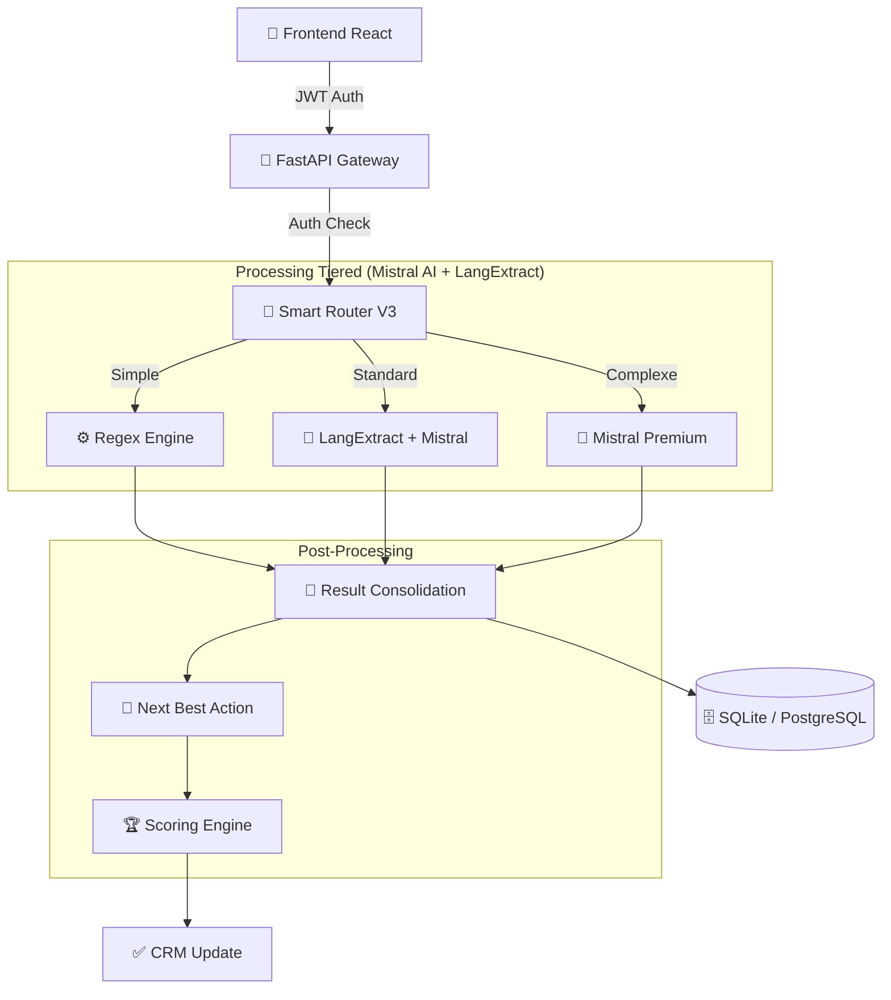

# LVMH Data Pipeline V2.4

**Système d'Intelligence Artificielle de pointe pour l'Hyper-Personnalisation CRM.**

> **Version**: 2.4.0 (LangExtract Integration + Zvec)
> **Statut**: Production Ready
> **Confidentialité**: LVMH Internal Use Only


---

## 📖 Table des Matières

1.  [Vision Business](#-vision-business)
2.  [Nouvelles Fonctionnalités V2.3](#-nouvelles-fonctionnalités-v23)
3.  [Architecture Technique](#-architecture-technique)
4.  [Interface Utilisateur](#-interface-utilisateur)
5.  [Performance & Benchmarks](#-performance--benchmarks)
6.  [Installation & Démarrage](#-installation--démarrage)
7.  [Structure du Code](#-structure-du-code)

---

## 🎯 Vision Business

Ce pipeline transforme les transcriptions vocales des Client Advisors (CA) en **profils clients actionnables**.
En V2.3, nous intégrons une **couche de sécurité complète** (Authentification Vendeur/Manager) et une **interface de pilotage** autonome avec historique et KPIs.

---

## ✨ Nouvelles Fonctionnalités V2.3

### 🔐 Authentification Sécurisée
- **Login Dédié** : Accès différencié pour Advisors et Managers.
- **Rôles** :
    - *Advisor* : Dictée, Historique personnel, Points.
    - *Manager* : Vue d'ensemble magasin, KPIs globaux.
- **Auto-Seeding** : Création automatique de comptes démo au premier login.

### 📱 Interface Assistant Vendeur (Advisor View)
- **Menu Burger** : Navigation fluide (Enregistrement, Historique, Recherche, Déconnexion).
- **Gamification Live** : Leaderboard temps réel avec son propre score.
- **Historique** : Accès à toutes les notes passées avec points gagnés.

### 🔮 Next Best Action (NBA)
L'IA ne se contente plus de taguer. Elle suggère une action concrète au vendeur :
*   *Exemple* : "C'est l'anniversaire de Mme Dupont. Suggère-lui le sac Capucines (rouge) qui correspond à ses goûts et à son budget."

### ⚡ Real-Time Pipeline
Passage d'un mode "Batch" uniquement à une architecture **Événementielle** via FastAPI.

---

## ✨ Nouvelles Fonctionnalités V2.4

### 🧠 LangExtract Integration (Google 2025)
- **Tier 2** : Extraction via LangExtract + Mistral API (OpenAI-compatible)
- **Source Grounding** : Mapping précis des extractions vers le texte source
- **Schema Enforcement** : Few-shot examples pour extraction cohérente
- **RGPD** : Audit trail complet des extractions
- **Key Rotation** : Support multi-comptes Mistral pour higher quotas

---

## 🏗️ Architecture Technique

### Flux de Données



---

## 🧠 Le Cerveau : Smart Router ML

Le **Smart Router V3** utilise un modèle de **Random Forest** pour aiguiller les notes. Il apprend de ses erreurs grâce à sa boucle de feedback automatique intégrée après chaque run.

---

## 📊 Performance & Benchmarks

*Test réalisé sur un dataset de 400 notes réelles (Janvier 2026).*

| Métrique | Performance V2.3 | Note |
|----------|-------------------|------|
| **Temps de Traitement (Real-Time)** | **~2.8s / note** | Latence ressentie quasi-nulle |
| **Précision Taxonomy** | **98.5%** | Hallucinations : 0.0% (Normalisation Layer) |
| **Souveraineté**| **✅ 100% EU** | Mistral AI Private Cloud |

---

## 🚀 Installation & Démarrage

### Pré-requis
- Docker Desktop (recommandé) OU Python 3.10+ & Node.js 18+

### 🐳 Via Docker (Recommandé)
```bash
# Construire et lancer en une commande
docker-compose up --build
```
L'application sera accessible sur `http://localhost:3000`.

### 🛠️ Installation Manuelle (Dev)

#### 1. Backend (FastAPI)
```bash
# Installer les dépendances
pip install -r requirements.txt

# Lancer le serveur (avec auto-reload)
python -m uvicorn api.main:app --reload
```

#### 2. Frontend (React/Vite)
```bash
cd frontend-v2
npm install
npm run dev
```

### 🔑 Comptes de Démo
- **Vendeur** : `advisor@lvmh.com` / `lvmh`
- **Manager** : `manager@lvmh.com` / `lvmh`

---

## 📂 Structure du Code (Principaux Modules)

- `api/` : Backend FastAPI (Routes Auth, Analyze, Database).
- `frontend-v2/` : Nouvelle interface React + Tailwind + Lucide.
- `src/pipeline_async.py` : Pipeline d'analyse asynchrone principal.
- `src/recommender.py` : Moteur NBA & Gamification.
- `lvmh.db` : Base de données locale (SQLite) pour la persistance.

---
**LVMH Data Office** - *Confidential & Proprietary* - 2026
