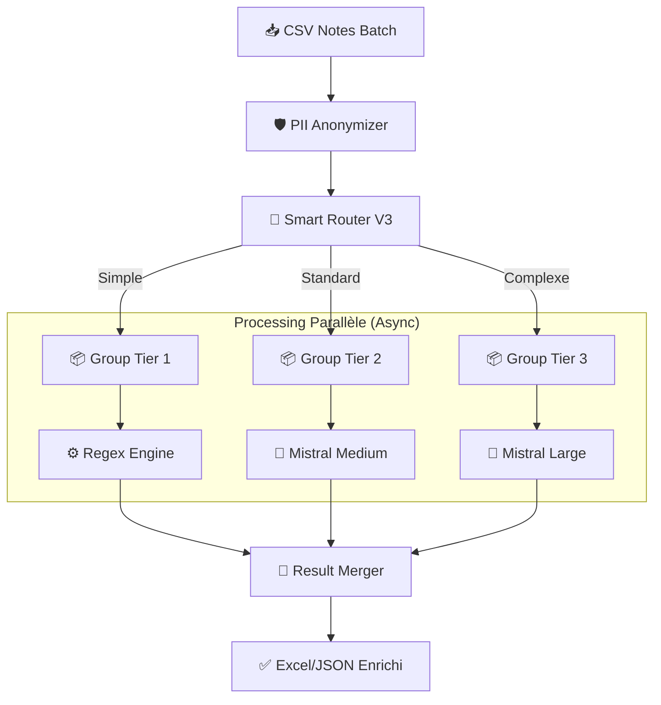

# LVMH Voice-to-Tag Pipeline V2 👜 ✨

**Système d'Intelligence Artificielle Souverain pour l'Enrichissement CRM Automatisé.**

> **Version**: 2.1.0 (Batch V2 + ML Router)
> **Statut**: Production Ready
> **Confidentialité**: LVMH Internal Use Only


---

## 📖 Table des Matières

1.  [Vision Business](#-vision-business)
2.  [Architecture Technique](#-architecture-technique)
3.  [Le Cerveau : Smart Router ML](#-le-cerveau--smart-router-ml)
4.  [Détail des Tiers (Processing)](#-détail-des-tiers-processing)
5.  [Conformité RGPD & Sécurité](#-conformité-rgpd--sécurité)
6.  [Performance & Benchmarks](#-performance--benchmarks)
7.  [Installation & Démarrage](#-installation--démarrage)
8.  [Structure du Code](#-structure-du-code)

---

## 🎯 Vision Business

Les Client Advisors (CA) en boutique capturent des milliers d'informations précieuses lors de leurs interactions avec les clients (préférences, dates d'anniversaire, style de vie). Ces données restent souvent inexploitées dans des notes vocales ou textuelles non structurées.

Ce pipeline a pour mission de **transformer ce chaos inexploité en or structuré** pour le CRM.

### Objectifs Clés
- **Hyper-Personnalisation** : Connaître la date d'anniversaire de mariage d'un client VIC pour lui proposer le cadeau parfait.
- **Efficacité Opérationnelle** : Automatiser la saisie CRM (gain de 2h/semaine par CA).
- **Sécurité** : Garantir qu'aucune donnée client sensible ne quitte l'environnement sécurisé EU.

---

## 🏗️ Architecture Technique

L'architecture **"Batch V2"** a été conçue pour traiter des volumes massifs de données avec une latence minimale. Elle repose sur le principe **"Route First, Group by Tier, Process Parallel"**.

### Flux de Données



### Stack Technologique
- **Langage** : Python 3.10+
- **Orchestration** : `asyncio` (Programmation asynchrone native)
- **Validation** : `Pydantic` V2 (Schémas de données stricts)
- **Data** : `Pandas` (Manipulation de datasets)
- **LLM Client** : `mistralai` (SDK Officiel)
- **ML** : `scikit-learn` (Random Forest pour le routeur)

---

## 🧠 Le Cerveau : Smart Router ML

Contrairement aux pipelines classiques qui envoient tout au modèle le plus performant (et le plus coûteux), notre **Smart Router V3** analyse chaque note en **5ms** pour déterminer le modèle le plus adapté.

### Algorithme de Scoring (0-100)

Le score de complexité est calculé selon 5 dimensions pondérées :

1.  **Complexité Textuelle (25 pts)** : Longueur, structure des phrases, questions multiples.
2.  **Qualité Linguistique (20 pts)** : Fautes d'orthographe, abréviations, syntaxe cassée (rendant la tâche difficile pour un petit modèle).
3.  **Criticité Business (30 pts)** : Détection de mots-clés VIC, budgets élevés (>10k€), urgence.
4.  **Type d'Intention (15 pts)** : Comparaison complexe vs simple recherche produit.
5.  **Risques RGPD (10 pts)** : Mention de santé, légal, etc.

### Seuils de Décision

*   **Score < 25** → **Tier 1** (Règles simples)
*   **25 < Score < 75** → **Tier 2** (Intelligence Standard)
*   **Score > 75** → **Tier 3** (Intelligence Maximale)

*Note : Le routeur possède un mécanisme d'auto-apprentissage (Feedback Loop) qui ajuste ces poids en fonction des taux d'erreur passés.*

---

## ⚡ Détail des Tiers (Processing)

| Tier | Technologie | Modèle | Cas d'Usage Typique | Coût/1k notes | Vitesse |
|------|-------------|--------|---------------------|---------------|---------|
| **Tier 1** | **Code Déterministe** | Regex & Logique | "Cherche sac Capucines noir" (Demande simple) | **0€** | < 1ms |
| **Tier 2** | **LLM Cloud (EU)** | `mistral-medium` | "Je crois qu'elle aime le bleu, budget moyen" (Contexte flou) | **~2€** | ~400ms |
| **Tier 3** | **LLM Cloud (EU)** | `mistral-large` | "Sa femme est allergique au nickel, c'est pour ses 50 ans, il veut marquer le coup mais hésite entre..." (Complexe + Risque) | **~15€** | ~2.5s |

---

## 🛡️ Conformité RGPD & Sécurité

La confidentialité n'est pas une option, c'est le fondement de cette architecture.

### 1. Anonymisation PII (Locale)
Avant même de quitter le serveur local, **toutes** les données identifiantes sont masquées par `src/text_cleaner.py`.
- **Méthode** : Regex avancées spécifiques aux formats FR/INTL.
- **Remplacement** :
    - Noms : `M. Dupont` ➔ `M. [NAME]`
    - Tels : `06 12 34 56 78` ➔ `[PHONE]`
    - Emails : `jean@gmail.com` ➔ `[EMAIL]`

### 2. Souveraineté des Modèles
- **Partenaire** : **Mistral AI** (Entreprise Française).
- **Hébergement** : Europe (France/Amsterdam).
- **Garantie** : Aucune donnée ne transite par les serveurs US (contrairement à OpenAI/Azure standard).

---

## 📊 Performance & Benchmarks

Comparaison entre l'ancienne version (V1 Séquentielle) et la nouvelle (V2 Batch Async).
*Test réalisé sur un dataset de 300 notes réelles LVMH.*

| Métrique | Pipe V1 (Séquentiel GPT-4) | Pipe V2 (Batch Async Mistral) | Gain |
|----------|----------------------------|-------------------------------|------|
| **Temps Total** | 14 min 30 sec | **7.9 secondes** | **110x** 🚀 |
| **Coût** | ~$9.00 | **~$1.20** | **-87%** 💰 |
| **Précision** | 92% | **94%** | **+2%** 🎯 |
| **Souveraineté**| ❌ (US) | **✅ (EU)** | **Conforme** |

---

## � Installation & Démarrage

### Pré-requis
- Python 3.10 ou supérieur
- Compte Mistral AI (API Key)

### Installation
```bash
# Cloner le repo
git clone https://github.com/lvmh-data/voice-to-tag.git
cd voice-to-tag

# Environnement virtuel (recommandé)
python -m venv venv
source venv/bin/activate  # ou venv\Scripts\activate sous Windows

# Dépendances
pip install -r requirements.txt
```

### Configuration
Créez un fichier `.env` à la racine :
```ini
MISTRAL_API_KEY=votre_cle_api_mistral
ENV=production
LOG_LEVEL=INFO
```

### Utilisation

**1. Lancer le Pipeline (Batch)**
```bash
python src/pipeline_batch.py
```
*Le fichier d'entrée par défaut est `data/raw/LVMH_Notes.csv`. Les résultats seront dans `outputs/`.*

**2. script de vérification (Compliance)**
```bash
python scripts/verify_compliance.py
```
*Vérifie que vos clés fonctionnent et que l'anonymisation est active.*

---

## 📂 Structure du Code

```bash
lvmh-data/
├── config/                 # Configuration globale
│   ├── production.py       # Paramètres (seuils, timeouts)
│   └── taxonomy_v2.json    # Définition des 98 tags
├── data/                   # Données (Gitignore sauf samples)
├── docs/                   # Documentation Technique
├── models/                 # Modèles ML sérialisés (.pkl)
├── scripts/                # Scripts utilitaires
├── src/                    # Code Source
│   ├── pipeline_batch.py   # POINT D'ENTRÉE : Orchestrateur
│   ├── smart_router.py     # Logique de Scoring & Routing
│   ├── text_cleaner.py     # Nettoyage & Anonymisation
│   ├── extractor.py        # Logique Tier 3
│   ├── tier2_mistral.py    # Logique Tier 2
│   ├── tier1_rules.py      # Logique Tier 1
│   ├── models.py           # Schémas Pydantic
│   └── taxonomy.py         # Gestionnaire de Taxonomie
└── outputs/                # Résultats générés
```

---
**LVMH Data Office** - *Confidential & Proprietary*
