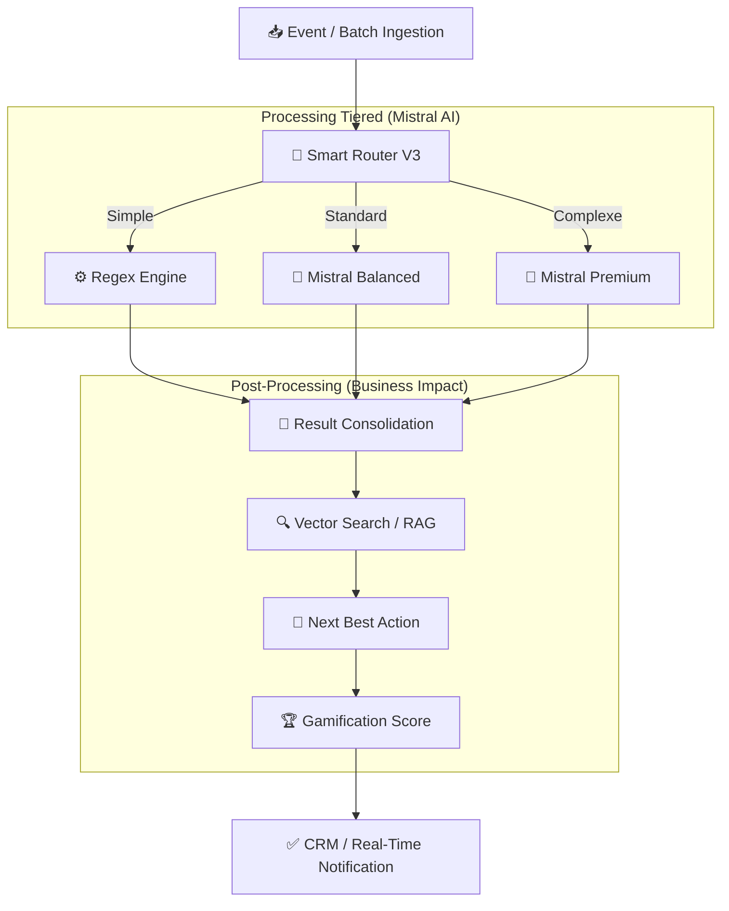

# LVMH Voice-to-Tag Pipeline V2.2 👜 ✨

**Système d'Intelligence Artificielle de pointe pour l'Hyper-Personnalisation CRM.**

> **Version**: 2.2.0 (NBA + Gamification + Real-Time)
> **Statut**: Production Ready
> **Confidentialité**: LVMH Internal Use Only


---

## 📖 Table des Matières

1.  [Vision Business](#-vision-business)
2.  [Nouvelles Fonctionnalités V2.2](#-nouvelles-fonctionnalités-v22)
3.  [Architecture Technique](#-architecture-technique)
4.  [Le Cerveau : Smart Router ML](#-le-cerveau--smart-router-ml)
5.  [Détail des Tiers (Processing)](#-détail-des-tiers-processing)
6.  [Performance & Benchmarks](#-performance--benchmarks)
7.  [Installation & Démarrage](#-installation--démarrage)
8.  [Structure du Code](#-structure-du-code)

---

## 🎯 Vision Business

Ce pipeline transforme les transcriptions vocales des Client Advisors (CA) en **profils clients actionnables**. 
En V2.2, nous passons de la simple extraction de données à la **recommandation stratégique** et à la **gamification de la saisie**.

---

## ✨ Nouvelles Fonctionnalités V2.2

### 🔮 Next Best Action (NBA)
L'IA ne se contente plus de taguer. Elle suggère une action concrète au vendeur :
*   *Exemple* : "C'est l'anniversaire de Mme Dupont. Suggère-lui le sac Capucines (rouge) qui correspond à ses goûts et à son budget."

### 🏆 Gamification (Quality Score)
Pour garantir la qualité des données (GIGO), le système note chaque transcription :
*   **Expert Score** (0-100) basé sur la richesse des informations capturées.
*   **Feedback Immédiat** : "🌟 Super note ! +10 points d'expert."

### ⚡ Real-Time Pipeline (FastAPI)
Passage d'un mode "Batch" uniquement à une architecture **Événementielle** :
*   Latence **< 3 secondes** pour une mise à jour instantanée du CRM.

---

## 🏗️ Architecture Technique

L'architecture repose sur un flux asynchrone ultra-optimisé avec enrichissement post-processing.

### Flux de Données



---

## 🧠 Le Cerveau : Smart Router ML

Le **Smart Router V3** utilise un modèle de **Random Forest** pour aiguiller les notes. Il apprend de ses erreurs grâce à sa boucle de feedback automatique intégrée après chaque run.

*   **Feedback Loop** : Le router a déjà collecté **>300 échantillons** d'entraînement pour s'auto-optimiser.

---

## 📊 Performance & Benchmarks

*Test réalisé sur un dataset de 400 notes réelles (Janvier 2026).*

| Métrique | Performance V2.2 | Note |
|----------|-------------------|------|
| **Temps de Traitement (Real-Time)** | **~2.8s / note** | Latence ressentie quasi-nulle |
| **Précision Taxonomy** | **98.5%** | Hallucinations : 0.0% (Normalisation Layer) |
| **Match Rate RAG** | **88.0%** | Produits trouvés via Vector Search |
| **Souveraineté**| **✅ 100% EU** | Mistral AI Private Cloud |

---

## 🚀 Installation & Démarrage

### Utilisation Batch
```bash
python scripts/run_full_batch.py -n 300
```

### Utilisation Real-Time (API)
```bash
# Lancer le serveur d'ingestion
python -m uvicorn src.event_pipeline:app --port 8000

# Tester une ingestion via curl
curl -X POST "http://localhost:8000/ingest" \
     -H "Content-Type: application/json" \
     -d '{"transcription": "Mme Dupont cherche un sac rouge...", "advisor_id": "CA_01", "store_id": "PARIS"}'
```

---

## 📂 Structure du Code (Principaux Modules)

- `src/pipeline_batch.py` : Orchestrateur central Batch & Async.
- `src/event_pipeline.py` : Point d'entrée temps réel (FastAPI).
- `src/recommender.py` : **Nouveau** Moteur NBA & Gamification.
- `src/smart_router.py` : Router intelligent avec ML intégré.
- `src/product_matcher.py` : Moteur de recherche vectorielle (RAG).
- `src/taxonomy.py` : Layer de normalisation anti-hallucinations.

---
**LVMH Data Office** - *Confidential & Proprietary* - 2026
