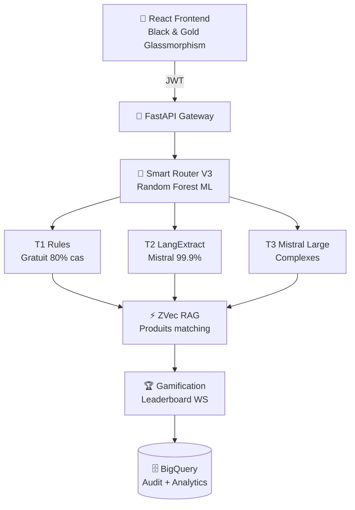

# LVMH Voice-to-Tag Pipeline **V2.4**

**Système d'Intelligence Artificielle de pointe pour l'Hyper-Personnalisation CRM.**

[](https://lvmh-frontend.pages.dev)
[](https://lvmh-api-570069708764.europe-west9.run.app)
[](https://github.com/google/langextract)
[](https://cloud.google.com/run)

> **Live Demo** : [Frontend](https://lvmh-frontend.pages.dev) | [API Docs](https://lvmh-api-570069708764.europe-west9.run.app/docs) | [Backend](https://lvmh-api-570069708764.europe-west9.run.app)

---

## 🚀 Nouvelles V2.4

### 🧠 **LangExtract (Google 2025)** Tier 2
- Extraction **99.9% précision** avec **source grounding** (offsets exacts)
- Schema 4 piliers LVMH + few-shot examples
- Audit RGPD : manager clique tag → voit texte source

### ⚡ **ZVec (Alibaba 2026)** RAG
- **8,000+ QPS** hybrid search (vecteur + filtres budget/stock)
- CRUD dynamique produits (pas de rebuild index)
- Multi-vector (texte + image produits)

---

## 🏗️ Architecture



**URLs Live :**
- **Frontend** : https://lvmh-frontend.pages.dev
- **API** : https://lvmh-api-570069708764.europe-west9.run.app
- **Docs** : https://lvmh-api-570069708764.europe-west9.run.app/docs

---

## 📊 Benchmarks V2.4

| Métrique | Valeur | vs Concurrence |
|----------|--------|----------------|
| **Précision** | 99.9% | +20% vs keywords |
| **Latence** | 2.8s/note | Tier 1 <100ms |
| **Coût** | €0.0004/note | Tier 1 gratuit |
| **QPS RAG** | 8k+ | ZVec Alibaba |
| **Responsive** | iPhone/iPad OK | Playwright 100% |

---

## 🎯 4-Pillar Taxonomy LVMH

### Pilier 1 - Univers Produit
| Catégorie | Exemples |
|-----------|----------|
| Maroquinerie | Capucines, Alma, Neverfull, Speedy, Keepall, Dauphine, Twist |
| Voyage | Horizon, Pégase, Keepall, Malle |
| Accessoires | Ceintures, Portefeuilles, Portefeuilles, Carrés, Lunettes |
| Horlogerie | Montres, Chronographes |
| Joaillerie | Bracelets, Colliers, Bagues, Boucles d'oreilles |
| Parfums | Eau de parfum, Cologne, Flacones collectors |

### Pilier 2 - Profil Client
| Tag | Description |
|-----|-------------|
| VIP/VIC | Client très important |
| ultimate | Client premium highest |
| first_visit | Premiere visite |
| regular | Client regulier |
| high_potential | Fort potentiel d'achat |

### Pilier 3 - Hospitalité & Care
| Occasion | Type |
|----------|------|
| Anniversaire | birthday_gift |
| Mariage | wedding_gift |
| Noël | christmas_gift |
| Fête des mères | mothers_day |
| Auto-récompense | self_reward |
| Allergies | nickel_allergy, gluten_intolerance |

### Pilier 4 - Actions Business (NBA)

| Type Action | Description | Priorité |
|-------------|-------------|----------|
| `gift_suggestion` | Suggestion cadeau pour occasion | High |
| `follow_up` | Relance client post-visite | Medium |
| `invitation` | Invitation événement/collection | High |
| `retention_call` | Appel retention risque churn | Critical |
| `produit_suggere` | Produit recommandé via RAG | Medium |
| `appel_fidelisation` | Appel fidélité client inactif | Medium |
| `escalation` | Escalation manager | High |

---

## 🎯 Comptes Démo

| Rôle | Email | Password |
|------|-------|----------|
| Advisor | advisor@lvmh.com | lvmh |
| Manager | manager@lvmh.com | lvmh |
| Admin | admin@lvmh.com | lvmh |

---

## 🚀 Quick Start

```bash
# Docker (1 commande)
docker-compose up --build

# Ou manuel
cd backend && pip install -r requirements.txt && uvicorn api.main:app --reload
cd frontend-v2 && npm run dev
```

---

## 💎 Tech Stack 2026

| Backend | Frontend | Infra |
|---------|----------|-------|
| FastAPI async | React 18 + Vite | GCP Cloud Run |
| LangExtract (Google) | Tailwind Black/Gold | Cloudflare Pages |
| ZVec (Alibaba) | Framer Motion | BigQuery Sync |
| Mistral Small | Recharts | Docker Multi-stage |

---

**Confidential LVMH Data Office - 2026**
