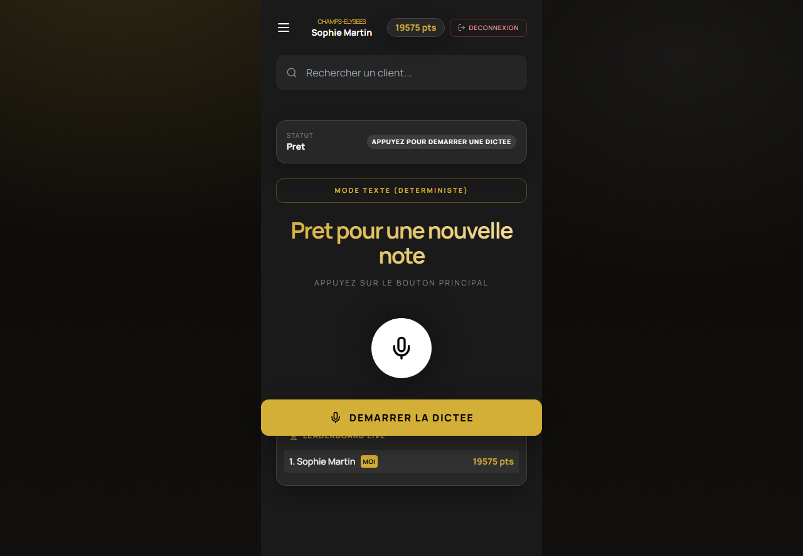
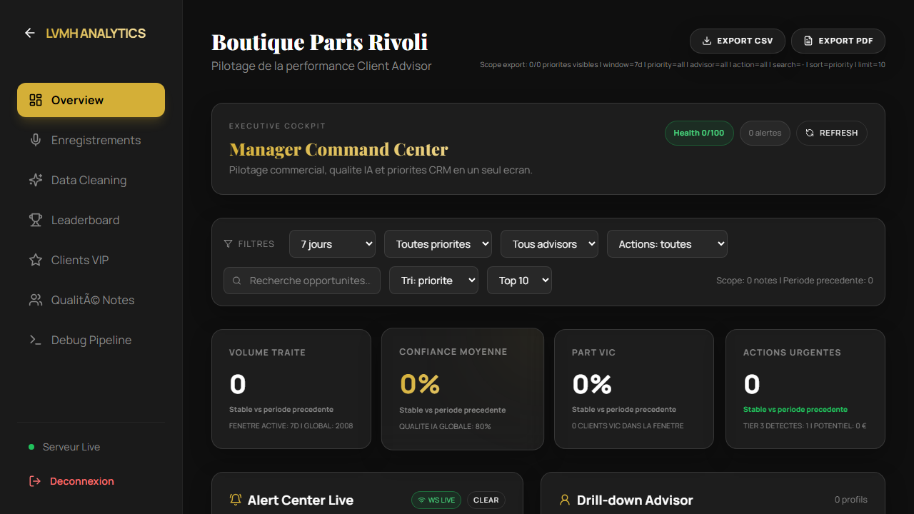
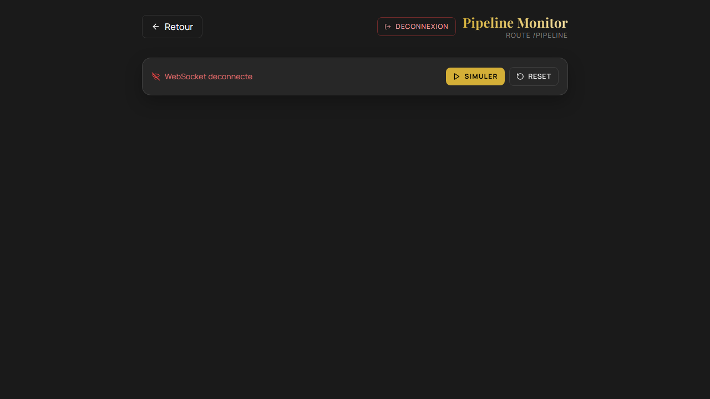
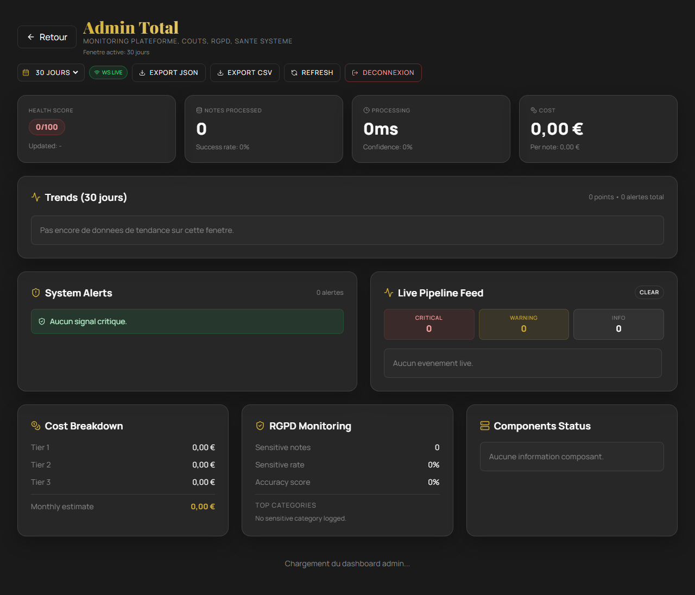
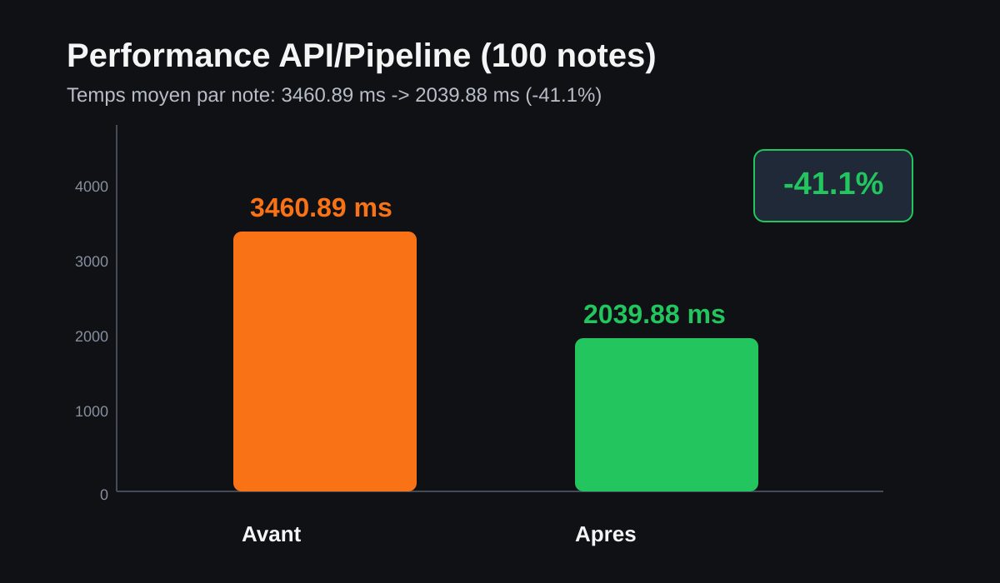

# 1. Vision
## LVMH Voice-to-Tag Pipeline V2.3
- Transformer la voix conseiller en CRM actionnable en temps reel.
- Objectif business: personnalisation luxe + acceleration des ventes.

---

# 2. Probleme
- Notes vocales heterogenes, difficilement exploitables.
- Risque de perte de signaux VIP, allergies, occasions.
- Temps conseiller gaspille sur la saisie manuelle.

---

# 3. Reponse Produit
- Smart Router V3: routage intelligent Tier 1/2/3.
- Extraction 4 piliers (produit, profil, hospitalite, action business).
- NBA automatique avec priorisation commerciale.

---

# 4. Demo UX - 4 Vues
- Vue `advisor`: saisie texte/voix, resultat instantane.
- Vue `manager`: pilotage equipe, opportunities, drilldown.
- Vue `pipeline`: observabilite temps reel.
- Vue `admin`: monitoring global et couts.

 
 

---

# 5. Parcours Demo (120s)
1. Login advisor.
2. Analyse note texte realiste (VIP + allergie).
3. Affichage tags + RGPD + NBA.
4. Bascule manager pour action immediate.

---

# 6. Architecture Technique
- Backend FastAPI async + SQLite/SQLAlchemy.
- LLM principal Mistral (fallback OpenAI/Groq).
- Frontend React Vite + visualisation pipeline WebSocket.
- Couches: cleaning -> routing -> extraction -> RAG -> NBA.

---

# 7. Smart Router V3
- Score 0-100 sur complexite, criticite, qualite linguistique, risque RGPD.
- Tier 1: regex rapide cout quasi nul.
- Tier 2: LLM standard.
- Tier 3: cas premium et critiques.

---

# 8. RGPD by Design
- Anonymisation avant appel LLM.
- Detection sensitive categories.
- Tracking explicite du flag `contains_sensitive`.
- Conformite integree au flux, pas post-traitement.

---

# 9. Parite API / Frontend
- Alignement de profil pipeline sur `single_note`.
- Stabilisation des types (`tier`, `contains_sensitive`, `tags`).
- Score combine de parite avec ponderation tier/RGPD/tags.

---

# 10. Performance Avant / Apres
- Gain mesure: **~41%** sur le temps moyen de traitement.
- Amelioration de la latence de queue (tail latency) observee.
- Build frontend optimise par chunks vendor.

---

# 11. Qualite Extraction
- Base actuelle: 84/100.
- Cible execution: 88/100.
- Focus gain: occasions + allergies + signaux business prioritaires.

---

# 12. ROI Metier
- Plus de notes exploitables sans surcharge conseiller.
- Meilleure conversion sur opportunites prioritaires.
- Capitalisation CRM immediate pour relance manager.

---

# 13. Positionnement Concurrentiel
- Pega (reference): 82 qualite.
- LVMH pipeline cible: 88 qualite + RGPD by design + cout maitrise.
- Differenciation: personnalisation luxe et vitesse execution.

---

# 14. Risques et Mitigation
- Risque parite tags: rapport mismatch par note + correction ciblee.
- Risque E2E audio: mode texte deterministe en CI.
- Risque planning: template deck fige + buffer lundi/mardi.

---

# 15. Roadmap Immediate
1. Jeudi: parite >= 90 (40 notes x1) + PDF jury.
2. Vendredi: E2E/API + qualite >= 88.
3. Samedi: repetition demo x10 + monitoring soutenance.
4. Buffer: uniquement si trigger critique.
